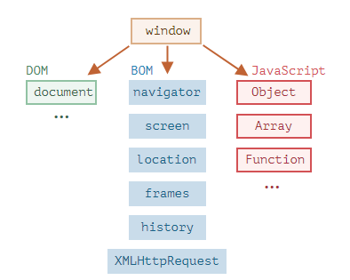

# Document Object Model - DOM

> There's a "root" object called `window`. It has two roles:

- First, it is a global object for javascript code.
- Second, it represents the "browser window" and provides methods to control it.

> Document Object Model, or DOM for short, represent all page content as object that can be modified
> The `document` object is the main "entry point" to the page. We can change or create anything on the page using it.

